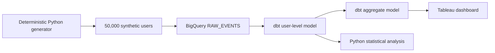

# E-Commerce Checkout A/B Test

This project is an end-to-end experimentation workflow for a fictional e-commerce checkout redesign. It generates a synthetic randomized experiment, loads the data into BigQuery, builds tested dbt models, evaluates conversion and purchase behavior in Python, and presents the results in Tableau.

**Stack:** Python · BigQuery · dbt · SciPy · Statsmodels · Tableau

## What problem does it solve?

The project evaluates whether a redesigned checkout experience improves customer conversion. It compares Control and Variant users, measures the size and uncertainty of the treatment effect, evaluates supporting revenue metrics, and translates the experiment into a simulated business recommendation.

Because the data are synthetic, the project demonstrates a complete experimentation workflow rather than establishing a real-world causal result.

## Data flow



The experimental unit is **one user**. Each user is assigned to Control or Variant and has one observation containing device, timestamp, conversion status, and checkout amount.

## What the project demonstrates

- **Experiment design:** randomized Control and Variant assignment across 50,000 synthetic users with deterministic generation and explicit metric definitions.
- **Validated analytics engineering:** BigQuery storage, dbt user-level and aggregate models, data-quality checks, and reconciliation between warehouse and Python outputs.
- **Statistical analysis:** two-proportion Z-test for conversion, Newcombe confidence intervals, Welch's t-test for AOV, and direction-aware decision logic.
- **Business interpretation:** conversion lift, AOV, revenue per assigned user, device-level performance, and a simulated rollout recommendation.
- **Reproducibility:** fixed random seeds, explicit BigQuery schemas, replace-based reloads, dbt tests, and a repeatable export-to-notebook workflow.

## Experiment results

The synthetic experiment covers **50,000 assigned users** during a simulated January 1-30, 2024 UTC observation period.

Conversion rate is the **primary metric**. AOV is a secondary metric calculated among converted users. Revenue per assigned user includes zero revenue from nonconverters.

| Arm | Users | Conversions | Conversion rate | Total revenue | AOV | Revenue / user |
| --- | ---: | ---: | ---: | ---: | ---: | ---: |
| Control | 25,053 | 3,000 | 11.9746% | $151,652.02 | $50.5507 | $6.0532 |
| Variant | 24,947 | 3,564 | 14.2863% | $196,194.21 | $55.0489 | $7.8644 |

The Variant improved conversion by **+2.3117 percentage points**, equivalent to a **19.30% relative lift**.

The 95% Newcombe confidence interval for the conversion difference is **+1.7199 to +2.9036 percentage points**. A two-sided two-proportion Z-test produced `z = +7.6532` and `p = 1.96e-14`.

At `alpha = 0.05`, the Variant has a statistically significant higher conversion rate in this synthetic experiment.

The secondary AOV difference was **+$4.4982**, with a 95% Welch confidence interval of **+$3.7626 to +$5.2338** and a two-sided `p = 9.31e-33`.

Revenue per assigned user increased by **+$1.8112**.

AOV is conditional on conversion, so the purchaser populations can differ between treatment arms. The AOV result does not imply that the same customers would necessarily spend more under Variant.

## Tableau dashboard

The Tableau dashboard summarizes the primary conversion result, secondary AOV metric, device-level performance, and the simulated business recommendation.

[View the published Tableau dashboard](https://public.tableau.com/app/profile/danieal.ahmed/viz/E-CommerceCheckoutABTest/ABTestResults)

[Tableau packaged workbook](tableau/E-Commerce%20Checkout%20AB%20Test.twbx)

Overall dashboard metrics are calculated from the underlying totals:

- **Conversion rate:** `SUM(total_conversions) / SUM(total_users)`
- **AOV:** `SUM(total_revenue) / SUM(total_conversions)`
- **Revenue per assigned user:** `SUM(total_revenue) / SUM(total_users)`

The device-level rows are not averaged to calculate overall rates.

## Repository structure

| Path | Contents |
| --- | --- |
| `generate_data.py` | Deterministic synthetic experiment generation |
| `validate_data.py` | User-level data validation |
| `dbt_models/` | User-level and aggregate BigQuery models |
| `tests/` | Python unit tests and dbt data tests |
| `experiment_decision.py` | Direction-aware experiment decision logic |
| `export_analysis.py` | BigQuery-to-Python analysis export |
| `ab_test_analysis.ipynb` | Statistical analysis and experiment results |
| `tableau/` | Packaged Tableau workbook |

## Getting started

On Python 3.13, create a virtual environment and install the project dependencies:

```powershell
py -3 -m venv .venv
.\.venv\Scripts\Activate.ps1
python -m pip install -r requirements.txt
```

Set the BigQuery configuration:

```powershell
$env:DBT_BIGQUERY_PROJECT = 'your-project-id'
$env:DBT_BIGQUERY_DATASET = 'ecommerce_data'
$env:DBT_BIGQUERY_LOCATION = 'US'

gcloud auth login
gcloud auth application-default login
Copy-Item profiles.yml.example profiles.yml
```

Create the dataset once if needed:

```powershell
bq --location=$env:DBT_BIGQUERY_LOCATION mk --dataset "$($env:DBT_BIGQUERY_PROJECT):$($env:DBT_BIGQUERY_DATASET)"
```

Generate and validate the synthetic dataset:

```powershell
python generate_data.py
python validate_data.py raw_experiment_logs.csv
```

Load the raw table into BigQuery:

```powershell
bq --location=$env:DBT_BIGQUERY_LOCATION load --replace --source_format=CSV --skip_leading_rows=1 --source_column_match=POSITION "$($env:DBT_BIGQUERY_PROJECT):$($env:DBT_BIGQUERY_DATASET).raw_events" raw_experiment_logs.csv "user_id:STRING,variant:STRING,device:STRING,event_time:DATETIME,converted:INTEGER,checkout_amount:NUMERIC"
```

Build and test the warehouse models:

```powershell
dbt run --profiles-dir .
dbt test --profiles-dir .
```

Export the user-level model and run the analysis:

```powershell
python export_analysis.py --project $env:DBT_BIGQUERY_PROJECT --dataset $env:DBT_BIGQUERY_DATASET --location $env:DBT_BIGQUERY_LOCATION
jupyter notebook ab_test_analysis.ipynb
```

**Reload policy:** each synthetic run replaces the full `raw_events` table. After reloading, rerun dbt and regenerate the analysis export before executing the notebook.

Google Cloud credentials are not stored in the repository. Local profiles, generated CSVs, virtual environments, dbt build artifacts, and caches are ignored by Git.

## Testing

Python validation and unit tests cover:

- unique user grain
- valid treatment and device assignments
- binary conversion values
- timestamp bounds
- paid-purchase consistency
- deterministic generation
- direction-aware experiment decisions

Run the Python test suite with:

```powershell
python -m unittest discover -s tests -p 'test_*.py'
```

dbt tests verify required fields, accepted values, unique users, purchase consistency, and reconciliation between user-level and aggregate metrics.

```powershell
dbt test --profiles-dir .
```

## Limits and future work

The data are synthetic and intentionally include a programmed treatment effect. The results therefore demonstrate whether the analytics workflow can recover that effect; they do not establish that a real checkout redesign would produce the same outcome.

The simulated recommendation to roll out the Variant is part of the fictional business case. A real experiment would also require guardrail metrics, operational considerations, and production monitoring before deployment.

Device-level differences are exploratory and were not generated from a separate device treatment mechanism. Formal power analysis and more complex experiment-design features are intentionally out of scope for this compact project.
